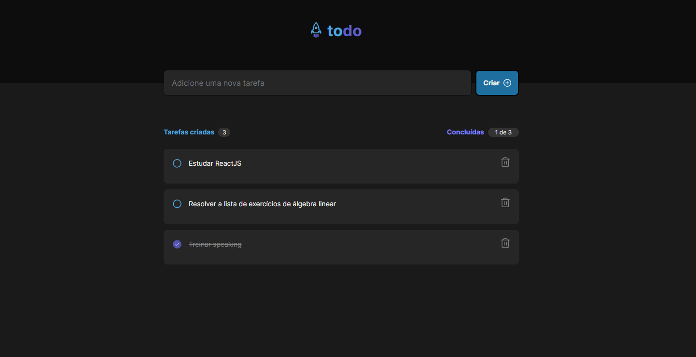

# To do list feito com ReactJS e TypeScript

Esse to do list foi um desafio proposto no curso de ReactJS da Rocketseat-Ignite.

## Layout

### funcionalidades:

- Adicionar uma nova tarefa
- Marcar e desmarcar uma tarefa como concluída
- Remover uma tarefa da listagem
- Mostrar o progresso de conclusão das tarefas

### Conceitos

- Estado
- Imutabilidade
- Lista e chaves no ReactJS
- Propriedades
- Componentização
- TypeScript no ReactJS
